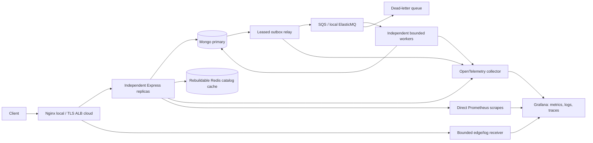

# Architecture and data guarantees

Protected requests verify authoritative Mongo sessions and account state through bounded linearizable primary reads. Independent session/account reads run concurrently; both must finish successfully before authorization, quota writes or mutations. Redis cannot authorize a revoked session. Requests already authorized before a completed revocation may finish. Refresh tokens are stored as hashes and rotate through an atomic compare-and-set; a replay or concurrent loser revokes the family and requires sign-in.

Product changes require a server-side administrator role. Cart, wishlist and job access are scoped to the authenticated owner. Mutations store an idempotency receipt and their effects in one majority transaction. A retry with the same key and input returns the saved response; changed input returns 409. Cart increments and guarded deletes retry transaction conflicts rather than lose committed increments.

Ingestion returns 202 only after a majority transaction commits the job, idempotency scope and outbox event. A leased relay publishes a versioned message and can publish twice after a crash. Workers commit the product effect and terminal state before acknowledging the message. Duplicate transport produces one logical effect. This is at-least-once transport with idempotent effects. Failed jobs are isolated after bounded attempts; redrive is an audited generation change.

Redis holds public catalog responses for at most 30 seconds from read start, with downward jitter, namespace invalidation, bounded payloads and per-process single-flight. Authorization/cookie requests bypass caching. A Redis outage uses a bounded Mongo fallback; overload is a visible 503. Nginx caching is disabled. Stock and payments are outside this catalog lab's acceptance contract.

The local environment has one Mongo member and one host. Separate containers prove process/replica behavior, not independent fault domains. Cloud IaC describes private ECS services, TLS ALB, WAF, encrypted Redis/SQS, private Atlas connectivity, separate runtime/migration identities and managed telemetry. That architecture remains undeployed while cloud configuration is absent.

Local gateway stale-address connection attempts are bounded to 250 milliseconds, with up to four upstream attempts within a four-second total retry budget. Writes retain the default non-idempotent replay protection described in the [NGINX proxy retry documentation](https://nginx.org/en/docs/http/ngx_http_proxy_module.html#proxy_next_upstream). Edge diagnostics retain upstream address/status/connect time without request bodies, query strings or authorization headers. A repeated three-cycle stop/restart test checks actual content and zero failures at 100 catalog requests/s; the report is separate from mixed-workload capacity.

## Configuration and boundaries

The serving container starts compiled code directly as a non-root user with a read-only root filesystem and bounded temporary space. The vertical entrypoint starts four workers in one 4 CPU/4 GiB container. Horizontal uses four 1 CPU/1 GiB API containers. Relay/worker pools, concurrency and queue leases are independent of API replicas. Mongo remains the authority across all of them.

Runtime source identity is recorded in an OCI image label. CI exports and hashes the tested image archive; security checks scan that archive; publication verifies identity, durability, scan and operational evidence before signing the registry digest. Production promotes the same tested digest and requires real staging business and SLO evidence.
